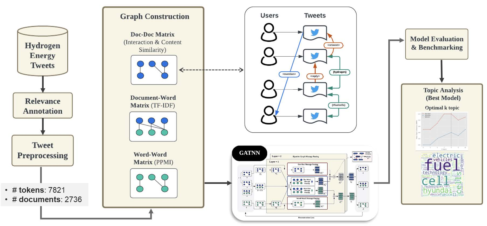
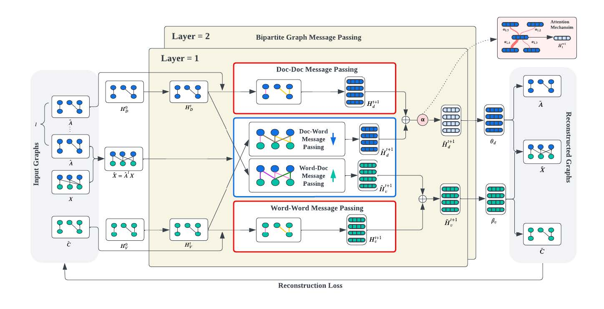

# Graph Attention Neural Network for Short-Text Topic Modelling using Document Neighbourhood Affinity: A Hydrogen Energy Discourse on Twitter

🔗 📄 [Research Paper](research_paper.pdf)

Twitter is a well-known social media platform that allows users to express their thoughts on current events through
micro-blogging, garnering the attention of text analysis practitioners in employing the topic modelling technique to unveil public
perceptions. Despite its importance, the discourse around hydrogen energy on Twitter has remained largely unexplored. Furthermore,
the exploration of high-order inter-document relationships within Graph Neural Networks, harnessing contextual tweet attributes
beyond text content, to address the sparsity issue in text representation, has been rather limited. Motivated by these gaps, our study
proposes a novel neighbourhood-assisted graph convolutional neural network topic model that capitalizes on the rich interaction
features of Twitter data to capture high-order document-document, document-word, and word-word relations in topic learning.
Moreover, it represents the first discourse study on Hydrogen Energy, examining the evolution of topics between 2013-2017 and
2018-2022.


## Baseline Models
### 1. Graph Topic Neural Network for Document Representation - GTNN

>First unified graph topic model, combining all document-document, document-word and word-word relations as knowledge graphs, leveraging high-order semantic learning and message propagation between words and documents for topic modelling. Source codes have been provided by author for this research.

Q. Xie, J. Huang, P. Du, M. Peng, and J.-Y. Nie, “Graph topic neural network for document representation,” in Proceedings of the Web Conference 2021, WWW ’21, (New York, NY, USA), p. 3055–3065, Association for Computing Machinery, 2021.


### 2. An Effective Short-Text Topic Modelling with Neighbourhood Assistance-Driven NMF in Twitter

>An established study that considered capturing tweets' neighbourhood information by Jaccard similarity to enhance topic quality. The study, however, only considered lexical similarity by word co-occurrences.

S. Athukorala and W. Mohotti, “An effective short-text topic modelling with neighbourhood assistance-driven nmf in twitter,” Social network analysis and mining, vol. 12, no. 1, pp. 89–89, 2022.


## Proposed Model - Graph Attention Topic Neural Network (GATNN)

>My research is motivated to integrate the tweets' deeper demantic relations as neighbourhood proximity as inputs into graph convolutional network. Model architecture wise, it is built upon the established model GTNN with the introduction of the novel attention mechanism for dynamic propagation of information amongst neighbourhoods. However, it sets itself apart from the other works by factoring tweet interactions and content for document proximity calculation.

<figure <figure style="text-align: center; margin: 0 auto">
    
    <figcaption><em>Experimental Workflow</em></figcaption>
</figure>

<figure <figure style="text-align: center; margin: 0 auto">
    
    <figcaption>Proposed Model Architecture</figcaption>
</figure>


## Folder Structures

Thanks to the authors of the baseline studies for sharing the source codes to make this study possible. Codes are located in the `Model\Baseline` directory with supplementary files and necessary modifications to work with our datasets.

```
├── Datasets/                   
│   ├── interannotator_score/           # interrater agreement evaluation using fleiss
│   ├── model_input_generator.py        # tweets doc-doc, doc-word, word-word matrices preparation
│   ├── tweet_similarity                # calculating tweets similarity
├── Model/                           
│   ├── Baseline/                       
│   │   ├── GTNN/                       # Source code and results for baseline model 1
│   │   └── NMF/                        # Source code and results for baseline model 2
│   └── MyModel/                        # Model execution code and results for proposed model
└── research_paper.pdf                  # Final research paper
```

## Implementation Environment
- Python == 3.9
- Tensorflow == 1.9.0
- Numpy == 1.17.4

## Run Experiments

You may find the specific commands to conduct all experiments in `run_experiments.bat` containing python command for running the experiments with different configurations.

The python command for running the `main.py` with the arguments of your choice is as follows:
```python
python main.py  --learning_rate         # default: 0.0025   
                --num_epoch             # default: 15000
                --trans_induc           # default: transductive
                --num_topics            # default: 64
                --training_ratio        # default: 0.8
                --minibatch_size        # default: 128
                --random_seed           # default: 950
                --num_hop               # default: 2
                --degree                # default: 2
                --adj_cut_off           # default: 0
                --doc_sim_metric        # default: cosine_tfidf
```

## Data

The raw and preprocessed datasets used for this research study are not publicised for privacy reasons.

## Output

The document embeddings are output to the `./results` file in each model directory. Each row represents one document embedding, and each column represents one dimension of the embedding, or one topic. 

